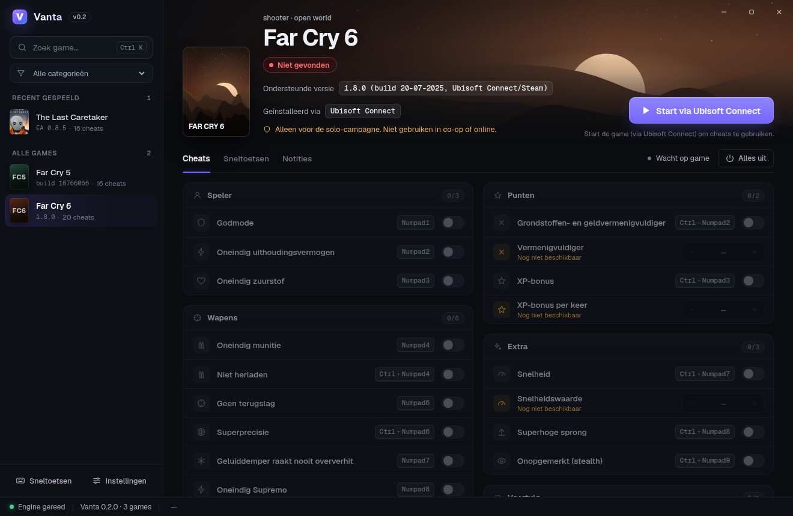

# Vanta

**Trainer voor singleplayer-games op Windows.** Losstaand programma, geen Cheat Engine nodig. Games met online anti-cheat
worden bewust geweigerd: Vanta is alleen bedoeld voor solo/offline spelen.

## Downloaden

Download de nieuwste `Vanta-v*.zip` bij [Releases](https://github.com/Rick007110/Vanta/releases/latest), pak hem uit naar
een eigen map (bijv. `C:\Games\Vanta`) en start `Vanta.exe`. Lees daarna `LEESMIJ.txt`.

* Windows 10/11 64-bit, Microsoft Edge WebView2 Runtime (standaard op Windows 11).
* Er hoeft niets geïnstalleerd te worden (.NET zit in de exe).
* De exe is niet digitaal ondertekend: SmartScreen kan waarschuwen ("Meer informatie" → "Toch uitvoeren").
* Controleer de download eventueel met het `.sha256`-bestand naast de zip.

## Games

| Game | Cheats | Status |
|---|---|---|
| The Last Caretaker (EA 0.8.5) | 16 | 1 bevestigd, rest ongetest |
| Far Cry 6 (1.8.0, Ubisoft Connect/Steam) | 20 | ongetest: controleer met `--verify` |
| Far Cry 5 (Steam-build 18766066) | 16 | ongetest: controleer met `--verify` |

Far Cry 5/6: alleen voor de solo-campagne, niet in co-op of online. Far Cry 6 heeft geen anti-cheat; bij Far Cry 5 is
EasyAntiCheat in de laatste patch (2019) verwijderd. Vindt Vanta toch anti-cheat-bestanden, dan weigert het.

## Wat Vanta doet

* **Winkel-herkenning**: vindt de installatie via Steam, Ubisoft Connect, Epic, GOG, EA app of Xbox en start de game via
  de juiste launcher ("Start via Ubisoft Connect").
* **Veilig patchen**: elke cheat zoekt zijn code via een AOB-patroon dat precies één keer moet voorkomen. Anders wordt er
  niets geschreven. Uitzetten, ontkoppelen of Vanta sluiten zet alle bytes exact terug.
* **`Vanta.exe --verify <game>`**: controleert zonder de game te starten of alle cheats bij jouw game-versie passen.
* **Automatische updates** via GitHub Releases, met SHA-256-controle, een backup en automatisch terugzetten als de nieuwe
  versie niet start.
* Sneltoetsen (ook als de game op de voorgrond staat), Nederlands/Engels.

## Zelf een game toevoegen

Een game is één JSON-bestand: `games/<id>/game.json` (schema: [`schema/game.schema.json`](schema/game.schema.json)).

1. Zet een Cheat Engine-tabel om: `Vanta.exe import "Game.CT" -o games\<id> --id <id> --name "Naam" --process Game.exe`
2. Los de gemarkeerde regels in `import-report.txt` met de hand op en vul `antiCheat`/`onlineOnly` eerlijk in.
3. `Vanta.exe validate games` en `Vanta.exe index games`
4. `Vanta.exe --verify <id> "pad\naar\module.dll"`: elke cheat moet precies 1 treffer hebben.

Details: [README-DEV.md](README-DEV.md).

## Community-meldingen (optioneel)

Met een Discord-account kun je melden of een cheat werkt of niet; Vanta toont dan per cheat wat andere spelers melden.
Inloggen is nooit verplicht: zonder account werkt alles zoals altijd. De backend is een Supabase-project (database +
inloggen, [`supabase/`](supabase/)); de Discord-bot ([`bot/`](bot/)) is los te hosten. Installatie: [docs/SETUP.md](docs/SETUP.md). Privacy: [docs/privacy.md](docs/privacy.md).

## Bouwen

`./build.sh` (dotnet 8 SDK; mingw voor het selftest-programma). Tests: `dotnet test tests/Vanta.Tests`,
UI: `node tests/ui/ui.e2e.js` (puppeteer-core + Chrome).

## English

Vanta is a standalone trainer for **single-player/offline** Windows games (no Cheat Engine required). Games with online
anti-cheat are refused. It detects installs from Steam, Ubisoft Connect, Epic, GOG, EA app and Xbox, patches code only when an
AOB pattern matches exactly once, restores every byte on disable/exit, can verify a game build offline
(`Vanta.exe --verify <game>`), and updates itself from GitHub Releases (SHA-256 verified, with rollback). Download the zip from
[Releases](https://github.com/Rick007110/Vanta/releases/latest). Far Cry 5/6 cheats are for the solo campaign only.

Optional community reports: sign in with Discord to report whether a cheat works; see [docs/SETUP.md](docs/SETUP.md) (Dutch)
and [docs/privacy.md](docs/privacy.md). Signing in is never required.

MIT License.
